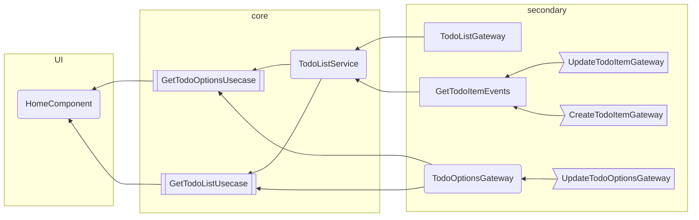

# CleanTodo

This Todo list project [avaibable here](https://clean-todo-list-o6eg.vercel.app/) aims to pratice clean architecture principles and rxjs reactive programming

Below a flowchart representing the project structure :

None exhaustive decisions made :

- UI testing is made at HomeComponent level, which is internally split
- Update events are secondary adapters
    * Allows testing without mixing usecases (asymmetric shape on the far right side)

## Development server

Run `ng serve` for a dev server. Navigate to `http://localhost:4200/`. The application will automatically reload if you change any of the source files.

## Build

Run `ng build` to build the project. The build artifacts will be stored in the `dist/` directory.

## Running unit tests

Run `ng test` to execute the unit tests via [Karma](https://karma-runner.github.io).

Run `npx stryker run` to execute mutation tests
